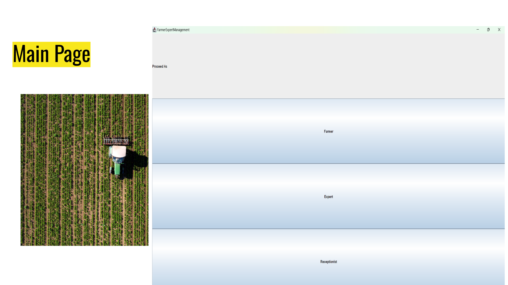
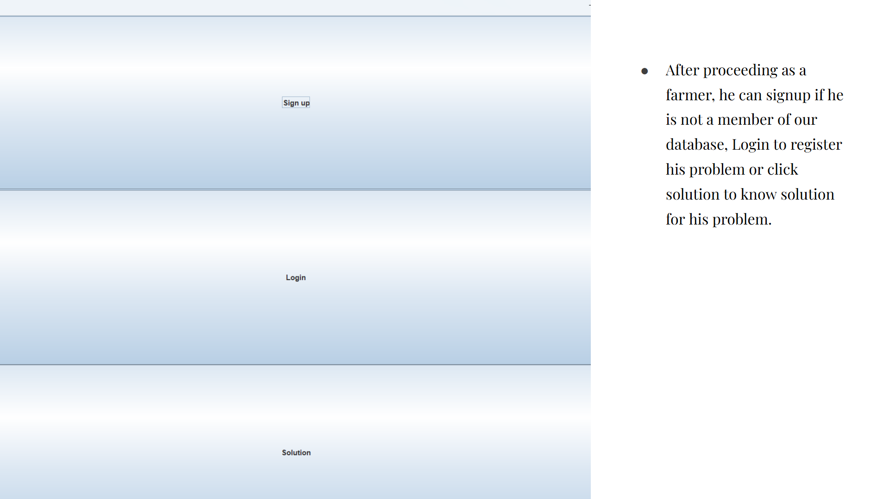
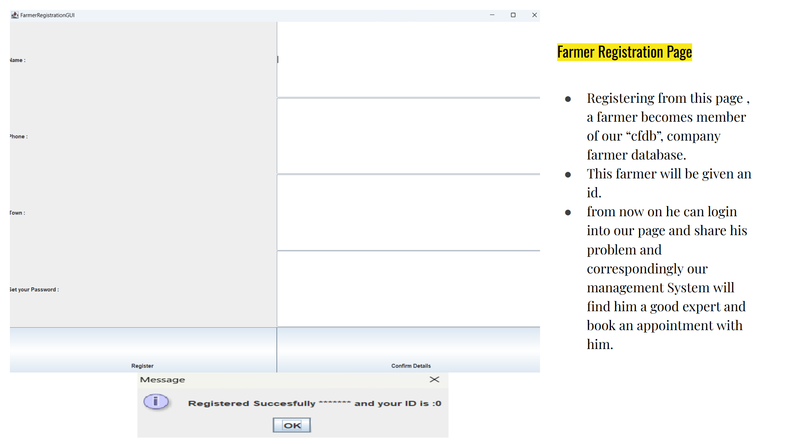
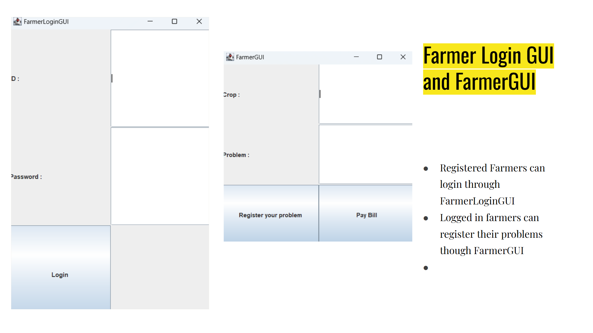
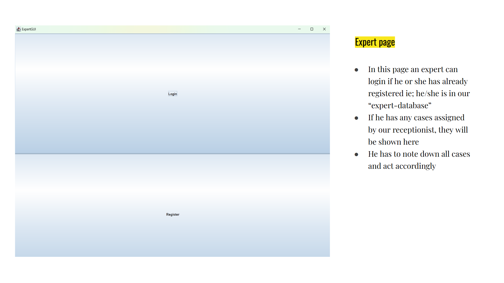
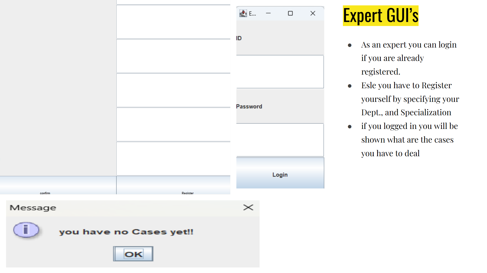
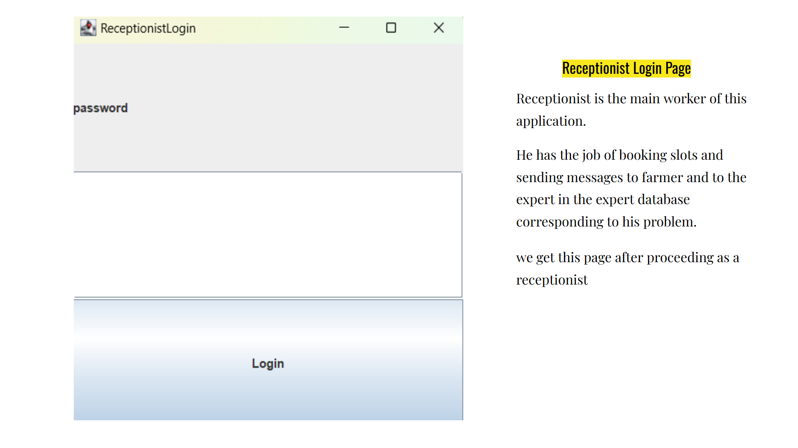
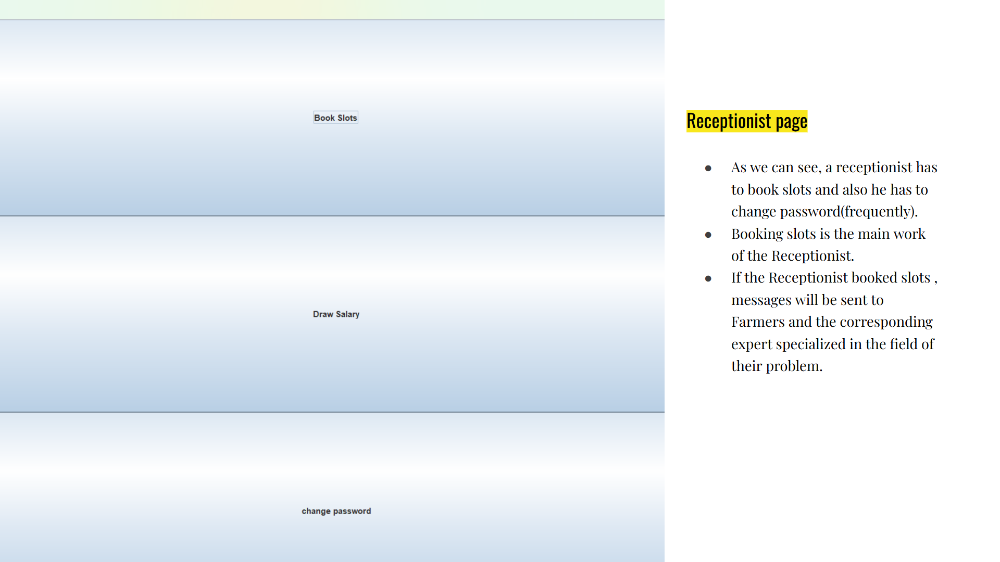

# Farmer Expert Management System 🌾

The **Farmer Expert Management System** is designed to bridge the gap between farmers and experts, providing a platform to streamline communication, solve problems efficiently, and offer expert guidance.  

---

## Agenda 📜

- Make farmer and expert meetings easier.  
- Enable farmers to explore available experts in their locality.  
- Help farmers resolve issues faster.  
- Provide expert guidance whenever needed.  

---

## Technologies Used 💻

- **Java**  
- **Java Swing**  
- **MySQL**  
- Future plan: **Google Colab** and **Python** for cloud computing to enhance processing speed.  

---

## Features Overview 🛠️  

### Main Page  
Upon opening the application, the main interface presents options to proceed as either a **Farmer**, **Expert**, or **Receptionist**.  
  

---

### Farmer Workflow 🌾  

1. **Signup/Login**  
   - Farmers who are not members of the database can **sign up** to become part of the **"cfdb"** (Company Farmer Database).  
   - Registered farmers can **log in**, register their problems, or view solutions.  
     

2. **Farmer Registration**  
   - Farmers provide necessary details during registration and receive a unique ID.  
   - After registering, they can submit problems, and the system will match them with suitable experts to book an appointment.  
   

3. **Farmer Login GUI**  
   - Registered farmers log in using the **FarmerLoginGUI**.  
   - After login, farmers can register problems or interact with experts via the **FarmerGUI**.  
   

---

### Expert Workflow 👨‍🔬  

1. **Expert Login/Registration**  
   - Experts can log in if they are already in the **expert-database**.  
   - New experts must register by specifying their **Department** and **Specialization**.  
   

2. **Expert GUI**  
   - Logged-in experts are presented with assigned cases.  
   - They can view the cases, note them, and act accordingly.  
   

---

### Receptionist Workflow 🛠️  

1. **Receptionist Login**  
   - The receptionist is the primary operator of the system.  
   - This page allows the receptionist to log in and access their dashboard.  
   

2. **Receptionist GUI**  
   - Responsibilities include booking slots for farmers and experts, managing passwords, and sending notifications.  
   - Booked slots trigger messages to the corresponding farmer and expert, ensuring seamless communication.  
   

---

## Final Thank You Page 🙏  
After completing all operations, the user is greeted with a **Thank You** page, indicating the successful use of the system.  

---

## Future Scope 🚀  

- **Cloud Integration**: Utilize **Google Colab** and **Python** for cloud computing to make the system more efficient.  
- **Enhanced Features**: Incorporate real-time notifications, data analytics, and AI-based recommendations for farmers.  

---

## How to Run the Application 🔧  

1. Clone the repository to your local system.  
2. Ensure you have **Java JDK** and **MySQL** installed.  
3. Configure the **MySQL database** with the provided SQL scripts in the project.  
4. Run the Java application using your preferred IDE or terminal.  

---